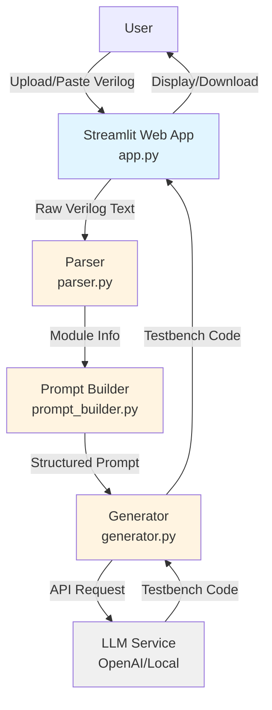
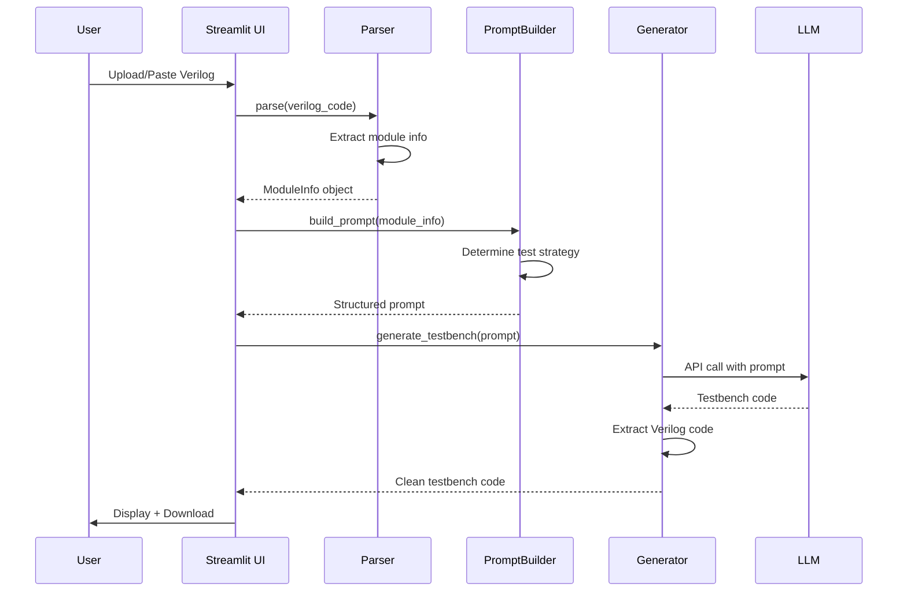

# Design Document: Verilog Testbench Generator

## Overview

The Verilog Testbench Generator is a web-based application that automates the creation of simulation-ready testbenches for Verilog RTL modules using Large Language Models (LLMs). The system follows a three-layer architecture:

1. **Presentation Layer**: Streamlit-based web interface for user interaction
2. **Business Logic Layer**: Parsing, prompt construction, and orchestration
3. **External Services Layer**: LLM integration (OpenAI API or local LLM)

The core workflow is:
1. User provides Verilog RTL module (upload or paste)
2. Parser extracts structural information (ports, signals, logic type)
3. Prompt Builder constructs structured LLM prompt with test strategy
4. Generator sends prompt to LLM and receives testbench code
5. Web application displays and allows download of generated testbench

This design emphasizes modularity, testability, and clean separation of concerns.

## Architecture

### System Architecture Diagram



### Layer Responsibilities

**Presentation Layer (app.py)**
- Render Streamlit UI components
- Handle file uploads and text input
- Orchestrate workflow between components
- Display results and error messages
- Provide download functionality

**Business Logic Layer**
- **parser.py**: Extract structural information from Verilog code
- **prompt_builder.py**: Construct LLM prompts with test strategies
- Validation and error handling

**External Services Layer (generator.py)**
- Interface with OpenAI API
- Interface with local LLM (alternative)
- Handle API errors and retries
- Parse and validate LLM responses

### Data Flow



## Components and Interfaces

### 1. Parser Module (parser.py)

**Purpose**: Extract structural information from Verilog RTL modules

**Public Interface**:
```python
class VerilogParser:
    def parse(self, verilog_code: str) -> ModuleInfo:
        """
        Parse Verilog code and extract module information.
        
        Args:
            verilog_code: Raw Verilog source code
            
        Returns:
            ModuleInfo object containing extracted data
            
        Raises:
            ParseError: If Verilog code is invalid or malformed
        """
        pass
```

**Internal Functions**:
- `_extract_module_name(code: str) -> str`: Extract module name using regex
- `_extract_ports(code: str) -> List[PortInfo]`: Extract port declarations
- `_detect_clock_signals(ports: List[PortInfo]) -> List[str]`: Identify clock signals
- `_detect_reset_signals(ports: List[PortInfo]) -> List[str]`: Identify reset signals
- `_classify_logic_type(code: str, has_clock: bool) -> LogicType`: Determine combinational vs sequential
- `_calculate_total_input_bits(ports: List[PortInfo]) -> int`: Sum input port widths

**Detection Logic**:
- Clock signals: Match patterns `clk`, `clock`, `CLK`, `CLOCK` (case-insensitive)
- Reset signals: Match patterns `rst`, `reset`, `RST`, `RESET` (case-insensitive)
- Sequential logic: Has clock/reset signals OR contains `always @(posedge` or `always @(negedge`
- Combinational logic: No clock signals AND no edge-sensitive always blocks

**Error Handling**:
- Return descriptive error if no module declaration found
- Return error if port list cannot be parsed
- Return error if module has no ports

### 2. Prompt Builder Module (prompt_builder.py)

**Purpose**: Construct structured prompts for LLM with test strategies

**Public Interface**:
```python
class PromptBuilder:
    def build_prompt(self, module_info: ModuleInfo) -> str:
        """
        Build structured LLM prompt with test strategy.
        
        Args:
            module_info: Parsed module information
            
        Returns:
            Formatted prompt string for LLM
        """
        pass
```

**Prompt Structure**:
```
You are a Verilog testbench generation expert.

MODULE INFORMATION:
- Name: <module_name>
- Logic Type: <Combinational/Sequential>
- Ports:
  - <port_name> (<direction>, <bit_width> bits)
  ...
- Clock Signals: <clock_list>
- Reset Signals: <reset_list>

TEST STRATEGY:
<strategy_based_on_input_bits>

REQUIREMENTS:
1. Create testbench module named "tb_<module_name>"
2. Include timescale directive
3. Declare inputs as reg, outputs as wire
4. Instantiate DUT with correct port mapping
5. <clock_generation_if_sequential>
6. Include test cases with $display statements
7. Add comments with expected outputs
8. Include $monitor for signal tracking
9. End with $finish

OUTPUT FORMAT:
- Pure Verilog code only
- No markdown formatting
- No explanatory text outside comments
- Simulation-ready code
```

**Test Strategy Logic**:
- If `total_input_bits <= 10`: "Generate exhaustive test cases covering all 2^N input combinations"
- If `total_input_bits > 10`: "Generate representative test cases including: all-zeros, all-ones, boundary values, alternating patterns, and edge cases"
- If `Sequential_Logic`: Add "Include reset behavior test and multi-cycle test sequences"

### 3. Generator Module (generator.py)

**Purpose**: Interface with LLM services and manage API calls

**Public Interface**:
```python
class TestbenchGenerator:
    def __init__(self, api_key: str = None, use_local: bool = False):
        """
        Initialize generator with API configuration.
        
        Args:
            api_key: OpenAI API key (if using OpenAI)
            use_local: Use local LLM instead of OpenAI
        """
        pass
    
    def generate(self, prompt: str) -> str:
        """
        Generate testbench code using LLM.
        
        Args:
            prompt: Structured prompt from PromptBuilder
            
        Returns:
            Clean Verilog testbench code
            
        Raises:
            GenerationError: If API call fails or response is invalid
        """
        pass
```

**Internal Functions**:
- `_call_openai_api(prompt: str) -> str`: Make OpenAI API request
- `_call_local_llm(prompt: str) -> str`: Make local LLM request
- `_extract_verilog_code(response: str) -> str`: Remove markdown/text from response
- `_validate_response(code: str) -> bool`: Validate critical elements (module, endmodule, DUT instantiation)
- `_retry_generation(prompt: str, max_retries: int = 2) -> str`: Retry logic with exponential backoff

**OpenAI Configuration**:
- Model: `gpt-4` or `gpt-3.5-turbo`
- Temperature: `0.2` (low for consistency)
- Max tokens: `2000`

**Local LLM Configuration**:
- Support for local API endpoint (e.g., Ollama, LM Studio)
- Configurable endpoint URL
- Same prompt format

**Response Processing**:
- Strip markdown code blocks (```verilog ... ```)
- Remove explanatory text before/after code
- Validate presence of module declaration
- Validate presence of endmodule
- Validate presence of DUT instantiation
- Treat LLM output as non-deterministic and validate all critical elements

**Retry Strategy**:
- Retry up to 2 times on generation failure
- Track retry count and provide feedback
- If all retries fail, display clear error message to user

### 4. Streamlit Application (app.py)

**Purpose**: Provide web interface and orchestrate workflow

**UI Components**:
```python
def main():
    st.title("Verilog Testbench Generator")
    st.write("Upload or paste your Verilog RTL module to generate a testbench")
    
    # Input section
    input_method = st.radio("Input Method", ["Upload File", "Paste Code"])
    
    if input_method == "Upload File":
        uploaded_file = st.file_uploader("Choose a Verilog file", type=['v', 'sv'])
        if uploaded_file:
            verilog_code = uploaded_file.read().decode()
    else:
        verilog_code = st.text_area("Paste Verilog Code", height=300)
    
    # Generate button
    if st.button("Generate Testbench"):
        # Orchestration logic
        pass
    
    # Display section (side-by-side)
    col1, col2 = st.columns(2)
    with col1:
        st.subheader("Input Verilog")
        st.code(verilog_code, language='verilog')
    
    with col2:
        st.subheader("Generated Testbench")
        st.code(testbench_code, language='verilog')
        st.download_button("Download Testbench", testbench_code, "testbench.v")
```

**Orchestration Logic**:
```python
try:
    # Show loading indicator
    with st.spinner('Generating testbench...'):
        # Parse
        parser = VerilogParser()
        module_info = parser.parse(verilog_code)
        
        # Build prompt
        prompt_builder = PromptBuilder()
        prompt = prompt_builder.build_prompt(module_info)
        
        # Generate with retry
        generator = TestbenchGenerator(api_key=st.secrets["OPENAI_API_KEY"])
        testbench_code = generator.generate_with_retry(prompt, max_retries=2)
        
        # Display success
        st.success("Testbench generated successfully!")
    
except ParseError as e:
    st.error(f"Parsing Error: {e}")
except ValidationError as e:
    st.error(f"Validation Error: {e}. The generated testbench is missing critical elements.")
except GenerationError as e:
    st.error(f"Generation Error: {e}. Please try again.")
except Exception as e:
    st.error(f"Unexpected Error: {e}")
```

**Configuration**:
- API keys stored in Streamlit secrets (`.streamlit/secrets.toml`)
- Option to toggle between OpenAI and local LLM
- Configurable in sidebar

## Data Models

### ModuleInfo

```python
@dataclass
class ModuleInfo:
    """Structured information about a Verilog module."""
    module_name: str
    ports: List[PortInfo]
    clock_signals: List[str]
    reset_signals: List[str]
    logic_type: LogicType
    total_input_bits: int
    raw_code: str  # Original Verilog code
```

### PortInfo

```python
@dataclass
class PortInfo:
    """Information about a single port."""
    name: str
    direction: PortDirection  # INPUT, OUTPUT, INOUT
    bit_width: int  # 1 for single bit, N for [N-1:0]
    is_vector: bool  # True if multi-bit
    range_str: str  # e.g., "[7:0]" or "" for single bit
```

### LogicType

```python
class LogicType(Enum):
    """Classification of module logic type."""
    COMBINATIONAL = "combinational"
    SEQUENTIAL = "sequential"
```

### PortDirection

```python
class PortDirection(Enum):
    """Port direction types."""
    INPUT = "input"
    OUTPUT = "output"
    INOUT = "inout"
```

### Custom Exceptions

```python
class ParseError(Exception):
    """Raised when Verilog parsing fails."""
    pass

class GenerationError(Exception):
    """Raised when testbench generation fails."""
    pass

class ValidationError(Exception):
    """Raised when LLM output validation fails."""
    pass
```

## LLM Output Validation

### Validation Requirements

The system treats LLM output as non-deterministic and must validate all critical elements before accepting the generated testbench.

**Critical Elements to Validate**:
1. **Module Declaration**: Must contain `module tb_<name>` or similar testbench module
2. **Module End**: Must contain `endmodule` keyword
3. **DUT Instantiation**: Must contain instantiation of the original module being tested

**Validation Logic**:
```python
def _validate_response(self, code: str, expected_module_name: str) -> bool:
    """
    Validate that generated testbench contains critical elements.
    
    Args:
        code: Generated Verilog code
        expected_module_name: Name of the module being tested
        
    Returns:
        True if validation passes
        
    Raises:
        ValidationError: If critical elements are missing
    """
    # Check for module declaration
    if not re.search(r'module\s+\w+', code):
        raise ValidationError("Generated code missing module declaration")
    
    # Check for endmodule
    if 'endmodule' not in code:
        raise ValidationError("Generated code missing endmodule keyword")
    
    # Check for DUT instantiation
    if expected_module_name not in code:
        raise ValidationError(f"Generated code missing DUT instantiation of '{expected_module_name}'")
    
    return True
```

**Error Handling**:
- If validation fails, raise `ValidationError` with descriptive message
- Trigger retry mechanism (up to 2 retries)
- If all retries fail, display error to user with suggestion to try again

### Retry Strategy

**Retry Configuration**:
- Maximum retries: 2
- Retry on: API failures, validation failures, timeouts
- No retry on: Parse errors (user input issue), invalid API key

**Retry Implementation**:
```python
def generate_with_retry(self, prompt: str, max_retries: int = 2) -> str:
    """
    Generate testbench with automatic retry on failure.
    
    Args:
        prompt: Structured prompt for LLM
        max_retries: Maximum number of retry attempts
        
    Returns:
        Validated testbench code
        
    Raises:
        GenerationError: If all retries fail
    """
    for attempt in range(max_retries + 1):
        try:
            # Generate
            response = self._call_llm_api(prompt)
            code = self._extract_verilog_code(response)
            
            # Validate
            self._validate_response(code, self.expected_module_name)
            
            return code
            
        except (ValidationError, APIError) as e:
            if attempt < max_retries:
                logger.warning(f"Generation attempt {attempt + 1} failed: {e}. Retrying...")
                time.sleep(1 * (attempt + 1))  # Exponential backoff
            else:
                raise GenerationError(f"Generation failed after {max_retries + 1} attempts: {e}")
```

**User Feedback During Retries**:
- Display retry status in UI: "Generation attempt 1 failed, retrying..."
- Show final error if all retries exhausted
- Preserve user input for manual retry


## Correctness Properties

*A property is a characteristic or behavior that should hold true across all valid executions of a system—essentially, a formal statement about what the system should do. Properties serve as the bridge between human-readable specifications and machine-verifiable correctness guarantees.*

### Property 1: Module Name Extraction

*For any* valid Verilog module with a module declaration, the parser SHALL extract the correct module name from the declaration.

**Validates: Requirements 4.1**

### Property 2: Port Information Extraction

*For any* valid Verilog module, the parser SHALL extract all ports with their correct names, directions (input/output/inout), and bit-widths.

**Validates: Requirements 4.2**

### Property 3: Invalid Input Error Handling

*For any* invalid or malformed Verilog code, the parser SHALL raise a ParseError with a descriptive error message rather than succeeding or crashing.

**Validates: Requirements 4.3**

### Property 4: Clock Signal Detection

*For any* Verilog module containing ports with names matching clock patterns (clk, clock, CLK, CLOCK), the parser SHALL identify those ports as clock signals.

**Validates: Requirements 4.4**

### Property 5: Reset Signal Detection

*For any* Verilog module containing ports with names matching reset patterns (rst, reset, RST, RESET), the parser SHALL identify those ports as reset signals.

**Validates: Requirements 4.5**

### Property 6: Structured Data Completeness

*For any* valid Verilog module, the parser SHALL return a ModuleInfo object with all required fields populated (module_name, ports, clock_signals, reset_signals, logic_type, total_input_bits).

**Validates: Requirements 4.6**

### Property 7: Port Declaration Format Independence

*For any* valid Verilog module, the parser SHALL successfully extract port information regardless of whether ports are declared in single-line or multi-line format.

**Validates: Requirements 4.7**

### Property 8: Sequential Logic Classification - Clock/Reset

*For any* Verilog module containing clock or reset signals, the parser SHALL classify the logic type as SEQUENTIAL.

**Validates: Requirements 5.1**

### Property 9: Sequential Logic Classification - Edge Sensitivity

*For any* Verilog module containing always blocks with edge-sensitive triggers (@(posedge or @(negedge), the parser SHALL classify the logic type as SEQUENTIAL.

**Validates: Requirements 5.2**

### Property 10: Combinational Logic Classification

*For any* Verilog module without clock signals, reset signals, or edge-sensitive always blocks, the parser SHALL classify the logic type as COMBINATIONAL.

**Validates: Requirements 5.3**

### Property 11: Exhaustive Test Strategy for Small Inputs

*For any* ModuleInfo with total_input_bits ≤ 10, the prompt builder SHALL generate a prompt specifying exhaustive test case coverage.

**Validates: Requirements 6.1**

### Property 12: Representative Test Strategy for Large Inputs

*For any* ModuleInfo with total_input_bits > 10, the prompt builder SHALL generate a prompt specifying representative test cases including edge cases.

**Validates: Requirements 6.2**

### Property 13: Standard Test Pattern Inclusion

*For any* ModuleInfo, the prompt builder SHALL generate a prompt that includes standard test patterns: all-zeros, all-ones, boundary values, and alternating bit patterns.

**Validates: Requirements 6.3, 6.4, 6.7, 6.8**

### Property 14: Sequential Logic Test Requirements

*For any* ModuleInfo with logic_type = SEQUENTIAL, the prompt builder SHALL generate a prompt that includes reset behavior testing and multi-cycle test sequences.

**Validates: Requirements 6.5, 6.6**

### Property 15: Module Information in Prompt

*For any* ModuleInfo, the prompt builder SHALL generate a prompt containing the module name, all port information, and logic type classification.

**Validates: Requirements 2.7**

### Property 16: Test Strategy in Prompt

*For any* ModuleInfo, the prompt builder SHALL generate a prompt containing explicit test strategy guidance.

**Validates: Requirements 2.8**

### Property 17: Output Format Requirements in Prompt

*For any* ModuleInfo, the prompt builder SHALL generate a prompt containing specific output format requirements (pure Verilog, no markdown, simulation-ready).

**Validates: Requirements 2.9**

### Property 18: LLM Output Validation - Module Declaration

*For any* generated testbench code, the validator SHALL verify the presence of a module declaration before accepting the output.

**Validates: Requirements 2.1 (LLM Output Reliability)**

### Property 19: LLM Output Validation - Module End

*For any* generated testbench code, the validator SHALL verify the presence of an endmodule keyword before accepting the output.

**Validates: Requirements 2.1 (LLM Output Reliability)**

### Property 20: LLM Output Validation - DUT Instantiation

*For any* generated testbench code, the validator SHALL verify the presence of the DUT instantiation (original module name) before accepting the output.

**Validates: Requirements 2.1 (LLM Output Reliability)**

### Property 21: Retry on Validation Failure

*For any* validation failure, the generator SHALL retry generation up to 2 times before reporting final failure.

**Validates: Requirements 2.2 (Retry Strategy)**

### Property 22: Final Error After Retries

*For any* generation that fails after all retry attempts, the generator SHALL raise a GenerationError with a descriptive message.

**Validates: Requirements 2.2 (Retry Strategy)**


## Error Handling

### Parser Errors

**ParseError Exception**:
- Raised when Verilog code cannot be parsed
- Contains descriptive message indicating the specific issue
- Does not crash the application

**Common Parse Error Scenarios**:
1. **No module declaration found**
   - Message: "No module declaration found in Verilog code"
   - Cause: Input doesn't contain `module <name>`

2. **Invalid port list**
   - Message: "Unable to parse port list for module <name>"
   - Cause: Malformed port declarations, missing semicolons, syntax errors

3. **Empty module**
   - Message: "Module <name> has no ports"
   - Cause: Module declared but no input/output ports

4. **Unclosed module**
   - Message: "Module declaration not properly closed (missing endmodule)"
   - Cause: Missing `endmodule` keyword

**Error Recovery**:
- Parser returns error immediately without attempting partial parsing
- Error message displayed in Streamlit UI with red error box
- User can correct input and retry

### Generator Errors

**GenerationError Exception**:
- Raised when LLM API call fails or returns invalid response
- Contains descriptive message about the failure

**Common Generation Error Scenarios**:
1. **API Connection Failure**
   - Message: "Failed to connect to OpenAI API: <error_details>"
   - Cause: Network issues, invalid API key, service unavailable
   - Recovery: Display error, suggest checking API key and network

2. **API Rate Limit**
   - Message: "OpenAI API rate limit exceeded. Please try again later."
   - Cause: Too many requests in short time
   - Recovery: Display error with retry suggestion

3. **Invalid API Response**
   - Message: "LLM returned invalid response (no Verilog code found)"
   - Cause: LLM output doesn't contain valid Verilog code
   - Recovery: Display error, suggest trying again

4. **Timeout**
   - Message: "Request timed out after 30 seconds"
   - Cause: LLM taking too long to respond
   - Recovery: Display error with retry suggestion

5. **Local LLM Unavailable**
   - Message: "Local LLM endpoint not reachable at <url>"
   - Cause: Local LLM service not running
   - Recovery: Display error with setup instructions

**Error Recovery**:
- All API errors caught and converted to user-friendly messages
- Original input preserved so user can retry
- Option to switch between OpenAI and local LLM if one fails

### UI Error Handling

**Streamlit Error Display**:
- Use `st.error()` for all error messages
- Clear, actionable error messages
- Preserve user input on error

**Input Validation**:
- Check for empty input before parsing
- Message: "Please provide Verilog code (upload file or paste code)"

**File Upload Validation**:
- Check file extension (.v or .sv)
- Check file size (warn if > 10KB)
- Handle file read errors gracefully

### Logging

**Application Logging**:
```python
import logging

logging.basicConfig(
    level=logging.INFO,
    format='%(asctime)s - %(name)s - %(levelname)s - %(message)s'
)

logger = logging.getLogger(__name__)
```

**Log Events**:
- Parser: Log module name and port count on successful parse
- Generator: Log API calls (without sensitive data)
- Errors: Log full exception details for debugging
- Performance: Log generation time

## Testing Strategy

### Overview

The testing strategy uses a dual approach:
- **Property-based tests**: Verify universal properties across randomized inputs (parser and prompt builder)
- **Unit tests**: Verify specific examples, edge cases, and error conditions
- **Integration tests**: Verify LLM integration and end-to-end workflow

### Property-Based Testing

**Framework**: [Hypothesis](https://hypothesis.readthedocs.io/) for Python

**Configuration**:
- Minimum 100 iterations per property test
- Each test tagged with comment referencing design property
- Tag format: `# Feature: verilog-testbench-generator, Property N: <property_text>`

**Test Organization**:
```
tests/
  test_parser_properties.py      # Properties 1-10
  test_prompt_builder_properties.py  # Properties 11-17
  test_parser_examples.py        # Example-based parser tests
  test_generator_integration.py  # Integration tests with mocked LLM
  test_e2e.py                   # End-to-end tests
```

**Property Test Examples**:

```python
# tests/test_parser_properties.py
from hypothesis import given, strategies as st
import hypothesis

# Feature: verilog-testbench-generator, Property 1: Module Name Extraction
@given(module_name=st.text(min_size=1, alphabet=st.characters(whitelist_categories=('Lu', 'Ll', 'Nd', 'Pc'))))
@hypothesis.settings(max_examples=100)
def test_module_name_extraction(module_name):
    """For any valid module name, parser should extract it correctly."""
    verilog_code = f"module {module_name}(input a, output b); endmodule"
    parser = VerilogParser()
    result = parser.parse(verilog_code)
    assert result.module_name == module_name

# Feature: verilog-testbench-generator, Property 4: Clock Signal Detection
@given(clock_name=st.sampled_from(['clk', 'clock', 'CLK', 'CLOCK', 'Clk']))
@hypothesis.settings(max_examples=100)
def test_clock_signal_detection(clock_name):
    """For any port matching clock patterns, parser should identify it as clock."""
    verilog_code = f"module test(input {clock_name}, input data, output q); endmodule"
    parser = VerilogParser()
    result = parser.parse(verilog_code)
    assert clock_name in result.clock_signals
```

**Custom Generators**:
```python
# Hypothesis strategy for generating valid Verilog modules
@st.composite
def verilog_module(draw):
    module_name = draw(st.text(min_size=1, max_size=20, alphabet=st.characters(whitelist_categories=('Lu', 'Ll', 'Nd'))))
    num_ports = draw(st.integers(min_value=1, max_value=10))
    ports = []
    for _ in range(num_ports):
        port_name = draw(st.text(min_size=1, max_size=15, alphabet=st.characters(whitelist_categories=('Lu', 'Ll', 'Nd'))))
        direction = draw(st.sampled_from(['input', 'output', 'inout']))
        bit_width = draw(st.integers(min_value=1, max_value=32))
        if bit_width == 1:
            ports.append(f"{direction} {port_name}")
        else:
            ports.append(f"{direction} [{bit_width-1}:0] {port_name}")
    
    port_list = ", ".join(ports)
    return f"module {module_name}({port_list}); endmodule"
```

### Unit Testing

**Framework**: pytest

**Coverage Areas**:
1. **Parser Edge Cases**:
   - Empty input
   - Module with no ports
   - Ports with unusual bit ranges [15:8]
   - Multiple modules in one file (should parse first)
   - Comments in port declarations
   - Mixed single-line and multi-line declarations

2. **Prompt Builder Edge Cases**:
   - Module with 0 input bits (only outputs)
   - Module with exactly 10 input bits (boundary)
   - Module with 11 input bits (boundary)
   - Module with very large bit-width ports (e.g., [1023:0])

3. **Generator Error Handling**:
   - Mock API failures (connection error, timeout, rate limit)
   - Mock invalid responses (no code, malformed code)
   - Test code extraction from markdown
   - Test code extraction from plain text

**Example Unit Tests**:
```python
# tests/test_parser_examples.py
def test_parse_simple_and_gate():
    """Test parsing a simple 2-input AND gate."""
    verilog = """
    module and_gate(
        input a,
        input b,
        output y
    );
        assign y = a & b;
    endmodule
    """
    parser = VerilogParser()
    result = parser.parse(verilog)
    
    assert result.module_name == "and_gate"
    assert len(result.ports) == 3
    assert result.logic_type == LogicType.COMBINATIONAL
    assert result.total_input_bits == 2

def test_parse_invalid_module_raises_error():
    """Test that invalid Verilog raises ParseError."""
    invalid_verilog = "this is not verilog"
    parser = VerilogParser()
    
    with pytest.raises(ParseError) as exc_info:
        parser.parse(invalid_verilog)
    
    assert "No module declaration found" in str(exc_info.value)
```

### Integration Testing

**LLM Integration Tests**:
- Use mocked LLM responses for predictable testing
- Test with real API in CI/CD (optional, with rate limiting)
- Verify prompt format and response parsing

**Example Integration Test**:
```python
# tests/test_generator_integration.py
from unittest.mock import Mock, patch

def test_generator_with_mocked_openai():
    """Test generator with mocked OpenAI API."""
    mock_response = """
    `timescale 1ns/1ps
    module tb_and_gate;
        reg a, b;
        wire y;
        and_gate dut(.a(a), .b(b), .y(y));
        initial begin
            a = 0; b = 0; #10;
            $finish;
        end
    endmodule
    """
    
    with patch('openai.ChatCompletion.create') as mock_create:
        mock_create.return_value = Mock(
            choices=[Mock(message=Mock(content=mock_response))]
        )
        
        generator = TestbenchGenerator(api_key="test_key")
        result = generator.generate("test prompt")
        
        assert "module tb_and_gate" in result
        assert "endmodule" in result
        assert "`timescale" in result
```

### End-to-End Testing

**Full Workflow Tests**:
- Test complete flow from Verilog input to testbench output
- Use real parser, prompt builder, and mocked generator
- Verify output is valid Verilog (basic syntax check)

**Example E2E Test**:
```python
# tests/test_e2e.py
def test_full_workflow_combinational():
    """Test complete workflow for combinational logic."""
    input_verilog = """
    module adder(
        input [3:0] a,
        input [3:0] b,
        output [4:0] sum
    );
        assign sum = a + b;
    endmodule
    """
    
    # Parse
    parser = VerilogParser()
    module_info = parser.parse(input_verilog)
    
    # Build prompt
    prompt_builder = PromptBuilder()
    prompt = prompt_builder.build_prompt(module_info)
    
    # Verify prompt contents
    assert "adder" in prompt
    assert "Combinational" in prompt or "combinational" in prompt
    assert "exhaustive" in prompt.lower()  # 8 input bits <= 10
    
    # Generate (with mock)
    with patch('openai.ChatCompletion.create') as mock_create:
        mock_create.return_value = Mock(
            choices=[Mock(message=Mock(content="module tb_adder; endmodule"))]
        )
        
        generator = TestbenchGenerator(api_key="test_key")
        testbench = generator.generate(prompt)
        
        assert "tb_adder" in testbench
```

### Test Coverage Goals

- **Parser**: 95%+ line coverage, 100% of properties tested
- **Prompt Builder**: 95%+ line coverage, 100% of properties tested
- **Generator**: 80%+ line coverage (excluding external API code)
- **App**: 70%+ line coverage (UI code harder to test)

### Continuous Integration

**CI Pipeline** (GitHub Actions / GitLab CI):
1. Run linting (flake8, black)
2. Run type checking (mypy)
3. Run unit tests with coverage
4. Run property-based tests (100 iterations)
5. Run integration tests (mocked)
6. Generate coverage report
7. Fail if coverage < 85%

**Test Execution Time**:
- Unit tests: < 5 seconds
- Property tests: < 30 seconds (100 iterations × ~17 properties)
- Integration tests: < 10 seconds (mocked)
- Total: < 1 minute

### Manual Testing

**UI Testing Checklist**:
- [ ] File upload works with .v and .sv files
- [ ] Text area accepts pasted code
- [ ] Generate button triggers workflow
- [ ] Loading indicator displays during generation
- [ ] Side-by-side display shows input and output
- [ ] Download button saves correct file
- [ ] Error messages display clearly
- [ ] Retry mechanism works on validation failure
- [ ] UI remains responsive during generation
- [ ] Works in Chrome, Firefox, Safari

**Example Modules for Manual Testing**:
1. Simple combinational (AND gate, 2 inputs)
2. Small combinational (4-bit adder, 8 inputs)
3. Large combinational (16-bit ALU, 33 inputs)
4. Simple sequential (D flip-flop with clock and reset)
5. Complex sequential (counter with enable, reset, clock)
6. Invalid module (syntax error)
7. Empty input

## Performance Requirements

### Response Time

**Expected Generation Time**: 2-10 seconds
- Parsing: < 100ms
- Prompt building: < 50ms
- LLM API call: 2-10 seconds (depends on LLM service)
- Validation: < 50ms
- Total: ~2-10 seconds

**Performance Optimization**:
- Use async/await for API calls (future enhancement)
- Cache parsed module info during retries
- Minimize prompt size while maintaining quality

### UI Responsiveness

**Loading Indicators**:
- Display spinner during generation: `st.spinner('Generating testbench...')`
- Show retry status: "Attempt 1 failed, retrying..."
- Progress feedback for long operations

**Non-Blocking Operations**:
- Streamlit handles UI updates automatically
- Use `st.spinner()` context manager for visual feedback
- Ensure error messages don't block UI

**Resource Management**:
- Close API connections properly
- Handle timeouts gracefully (30 second timeout)
- Limit concurrent requests (single user session)

## Future Enhancements

### Planned Features

1. **SystemVerilog Assertions (SVA)**
   - Generate SVA properties for formal verification
   - Add assertion-based verification to testbenches
   - Support for concurrent assertions

2. **Multi-Module Testbench Generation**
   - Support for hierarchical designs
   - Generate testbenches for module hierarchies
   - Handle inter-module dependencies

3. **Coverage-Driven Verification**
   - Generate functional coverage points
   - Add covergroups to testbenches
   - Coverage analysis and reporting

4. **Simulator Integration**
   - Direct integration with ModelSim/Questa
   - Automated simulation execution
   - Parse simulation results and display in UI

5. **Waveform Visualization**
   - Generate VCD files from simulation
   - Display waveforms in web UI
   - Interactive waveform viewer

6. **Advanced Test Strategies**
   - Constrained random testing
   - Directed random testing
   - Corner case generation using formal methods

7. **Template Customization**
   - User-defined testbench templates
   - Configurable test patterns
   - Custom verification methodologies (UVM-lite)

8. **Batch Processing**
   - Upload multiple modules
   - Generate testbenches in batch
   - Export as zip file

### Technical Debt and Improvements

1. **Async API Calls**
   - Use `asyncio` for non-blocking LLM calls
   - Improve UI responsiveness

2. **Caching**
   - Cache LLM responses for identical inputs
   - Reduce API costs and latency

3. **Advanced Parsing**
   - Use proper Verilog parser (e.g., PyVerilog, Pyverilog)
   - Support for SystemVerilog syntax
   - Handle preprocessor directives

4. **Testing Infrastructure**
   - Add more property-based tests
   - Integration tests with real LLM
   - Performance benchmarking

5. **Documentation**
   - User guide with examples
   - API documentation
   - Video tutorials

