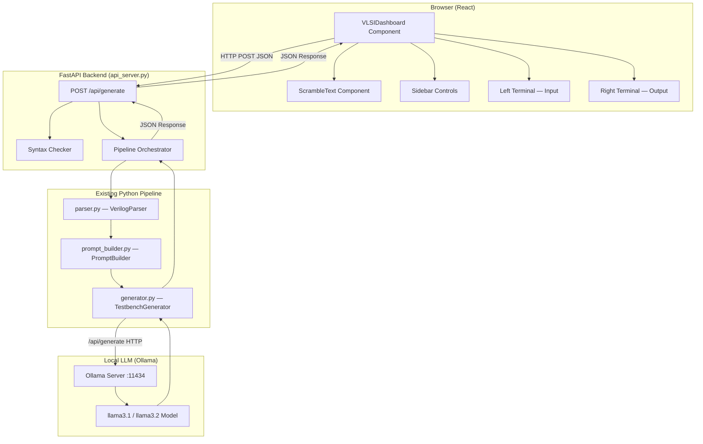

# Design Document: VLSI Dashboard UI — Verilog Testbench Generator

## Overview

The Verilog Testbench Generator is being upgraded from a Streamlit-only application to a full-stack system with a React-based VLSI Dashboard frontend and a FastAPI backend that bridges the React UI to the existing Python/Ollama pipeline.

The system has three distinct layers:

1. **React Frontend (VLSIDashboard)**: A futuristic, dark-themed dashboard with dual terminal panels, animated effects, and sidebar controls. Users paste Verilog RTL code into the left terminal, click Generate, and see the AI-produced testbench appear in the right terminal — along with syntax warnings and performance metrics.

2. **FastAPI Backend (api_server.py)**: A thin HTTP adapter that receives JSON from the React frontend, invokes the existing Python pipeline (parser → prompt_builder → generator), and returns a structured JSON response conforming to the agreed contract. This layer is the only new Python code required.

3. **Existing Python Pipeline**: `parser.py`, `prompt_builder.py`, and `generator.py` remain unchanged. The FastAPI layer calls them directly as library imports, preserving all existing logic and tests.

The Streamlit app (`app.py`) continues to work independently as a fallback UI.

---

## Part 1 — High-Level Design

### 1.1 System Architecture



### 1.2 End-to-End Data Flow

```mermaid
sequenceDiagram
    participant U as User (Browser)
    participant VD as VLSIDashboard
    participant API as FastAPI /api/generate
    participant PAR as VerilogParser
    participant PB as PromptBuilder
    participant GEN as TestbenchGenerator
    participant OL as Ollama :11434

    U->>VD: Paste Verilog code, click Generate
    VD->>VD: setIsGenerating(true), animate ScrambleText
    VD->>API: POST /api/generate {verilogCode, model, ollamaUrl}
    API->>PAR: parser.parse(verilog_code)
    PAR-->>API: ModuleInfo (ports, logic_type, clocks, resets)
    API->>API: _check_syntax(verilog_code) → warnings[]
    API->>PB: prompt_builder.build_prompt(module_info)
    PB-->>API: structured_prompt string
    API->>GEN: generator.generate_with_retry(prompt, module_name)
    GEN->>OL: POST /api/generate {model, prompt, stream:false}
    OL-->>GEN: {response: "...verilog..."}
    GEN->>GEN: _extract_verilog_code(), _validate_response()
    GEN-->>API: clean testbench string
    API->>API: build JSON response with metrics
    API-->>VD: {status, syntaxCheck, generatedTestbench, metrics}
    VD->>VD: setIsGenerating(false), setOutputCode(), setSyntaxWarning()
    VD-->>U: Right terminal shows testbench, warning badge visible
```

### 1.3 Component Responsibilities

#### React Frontend Components

| Component | File | Responsibility |
|-----------|------|----------------|
| `VLSIDashboard` | `src/components/VLSIDashboard.tsx` | Root component. Owns all state, calls the API, renders layout |
| `ScrambleText` | `src/components/VLSIDashboard.tsx` | Animates button label with character scramble during generation |
| `LeftTerminal` | inline in VLSIDashboard | Editable `<textarea>` for Verilog input with syntax highlighting chrome |
| `RightTerminal` | inline in VLSIDashboard | Read-only output panel displaying generated testbench |
| `Sidebar` | inline in VLSIDashboard | Model selector, Ollama URL input, max-retries control |
| `SyntaxWarningBadge` | inline in VLSIDashboard | Amber alert strip shown when `syntaxWarning` state is non-null |
| `MetricsBar` | inline in VLSIDashboard | Shows `generationTime`, `tokensPerSecond`, `totalTokens` after generation |

#### Backend Components

| Component | File | Responsibility |
|-----------|------|----------------|
| `FastAPI app` | `api_server.py` | HTTP server, CORS, request validation, response serialization |
| `generate_endpoint` | `api_server.py` | Orchestrates parse → prompt → generate pipeline |
| `_check_syntax` | `api_server.py` | Ported from `app.py`; checks begin/end balance and parentheses |
| `VerilogParser` | `parser.py` | Extracts module name, ports, logic type (unchanged) |
| `PromptBuilder` | `prompt_builder.py` | Builds structured LLM prompt (unchanged) |
| `TestbenchGenerator` | `generator.py` | Calls Ollama, extracts and validates Verilog (unchanged) |

### 1.4 Key Design Decisions

**Why FastAPI instead of modifying app.py?**
The existing Streamlit app is a working product. Adding a REST API layer as a separate process (`api_server.py`) means zero risk to the existing UI and zero changes to the tested Python modules. The React frontend and Streamlit frontend can coexist, both calling the same pipeline.

**Why not use Streamlit's built-in API?**
Streamlit is not designed as an API server. FastAPI gives us proper CORS handling, Pydantic request/response validation, async support, and a clean OpenAPI spec — all needed for a React SPA.

**Why keep the JSON contract flat?**
The agreed contract (`status`, `syntaxCheck`, `generatedTestbench`, `metrics`) maps directly to React state variables. A flat structure minimises destructuring complexity in the frontend and makes the contract easy to mock during frontend development.

**Why ScrambleText on the button?**
The scramble effect provides immediate visual feedback that generation is in progress without a separate spinner overlay that would obscure the terminal panels. It also reinforces the "VLSI terminal" aesthetic.

---

## Part 2 — Low-Level Design

### 2.1 JSON API Contract

#### Request — `POST /api/generate`

```typescript
interface GenerateRequest {
  verilogCode: string;      // Raw Verilog RTL source, required, non-empty
  model?: string;           // Ollama model name, default "llama3.1"
  ollamaUrl?: string;       // Ollama base URL, default "http://localhost:11434"
  maxRetries?: number;      // 1–3, default 2
}
```

#### Response — success / warning

```typescript
interface GenerateResponse {
  status: "success" | "warning" | "error";
  syntaxCheck: {
    isValid: boolean;
    message: string;        // Human-readable summary
    errorLines: number[];   // Line numbers with issues (empty if none)
  };
  generatedTestbench: string;   // Complete Verilog testbench, empty on error
  metrics: {
    tokensPerSecond: number;    // Estimated from total_tokens / elapsed_seconds
    totalTokens: number;        // Character count / 4 (approximation for Ollama)
  };
}
```

**Status semantics**:
- `"success"` — testbench generated, syntax checks passed
- `"warning"` — testbench generated but syntax warnings exist (e.g., unbalanced begin/end)
- `"error"` — generation failed; `generatedTestbench` is `""`, `syntaxCheck.message` contains the error

#### Error response example

```json
{
  "status": "error",
  "syntaxCheck": {
    "isValid": false,
    "message": "ParseError: No module declaration found in Verilog code",
    "errorLines": []
  },
  "generatedTestbench": "",
  "metrics": { "tokensPerSecond": 0, "totalTokens": 0 }
}
```

### 2.2 FastAPI Backend — `api_server.py`

#### Pydantic Models

```python
from pydantic import BaseModel, Field
from typing import List

class GenerateRequest(BaseModel):
    verilogCode: str = Field(..., min_length=1)
    model: str = Field(default="llama3.1")
    ollamaUrl: str = Field(default="http://localhost:11434")
    maxRetries: int = Field(default=2, ge=1, le=3)

class SyntaxCheck(BaseModel):
    isValid: bool
    message: str
    errorLines: List[int]

class Metrics(BaseModel):
    tokensPerSecond: float
    totalTokens: int

class GenerateResponse(BaseModel):
    status: str          # "success" | "warning" | "error"
    syntaxCheck: SyntaxCheck
    generatedTestbench: str
    metrics: Metrics
```

#### Endpoint Implementation

```python
import time
from fastapi import FastAPI
from fastapi.middleware.cors import CORSMiddleware
from parser import VerilogParser, ParseError
from prompt_builder import PromptBuilder
from generator import TestbenchGenerator, GenerationError, ValidationError

app = FastAPI(title="Verilog Testbench Generator API")

app.add_middleware(
    CORSMiddleware,
    allow_origins=["http://localhost:5173", "http://localhost:3000"],
    allow_methods=["POST", "OPTIONS"],
    allow_headers=["Content-Type"],
)

@app.post("/api/generate", response_model=GenerateResponse)
async def generate(req: GenerateRequest) -> GenerateResponse:
    """
    Orchestrate parse → syntax-check → prompt → generate pipeline.

    Preconditions:
      - req.verilogCode is non-empty string
      - req.ollamaUrl is reachable (not validated here; GenerationError raised if not)
      - req.maxRetries is in [1, 3]

    Postconditions:
      - Returns GenerateResponse with status in {"success", "warning", "error"}
      - On success/warning: generatedTestbench is non-empty valid Verilog
      - On error: generatedTestbench is ""
      - metrics.tokensPerSecond >= 0
      - Never raises an unhandled exception (all errors mapped to status="error")
    """
    t_start = time.perf_counter()

    try:
        # Step 1: Parse
        parser = VerilogParser()
        module_info = parser.parse(req.verilogCode)

        # Step 2: Syntax check (runs on input code, not generated code)
        warnings = _check_syntax(req.verilogCode)
        error_lines = _extract_error_lines(req.verilogCode, warnings)

        # Step 3: Build prompt
        pb = PromptBuilder()
        prompt = pb.build_prompt(module_info)
        fallback = _build_fallback_prompt(module_info)

        # Step 4: Generate
        gen = TestbenchGenerator(use_local=True)
        gen.ollama_model = req.model
        gen.ollama_url = req.ollamaUrl
        testbench = gen.generate_with_retry(
            prompt=prompt,
            module_name=module_info.module_name,
            max_retries=req.maxRetries,
            fallback_prompt=fallback,
        )

        elapsed = time.perf_counter() - t_start
        total_tokens = len(testbench) // 4
        tps = round(total_tokens / elapsed, 1) if elapsed > 0 else 0.0

        status = "warning" if warnings else "success"
        syntax_msg = "; ".join(warnings) if warnings else "No syntax issues detected"

        return GenerateResponse(
            status=status,
            syntaxCheck=SyntaxCheck(
                isValid=len(warnings) == 0,
                message=syntax_msg,
                errorLines=error_lines,
            ),
            generatedTestbench=testbench,
            metrics=Metrics(tokensPerSecond=tps, totalTokens=total_tokens),
        )

    except ParseError as e:
        return _error_response(f"ParseError: {e}")
    except ValidationError as e:
        return _error_response(f"ValidationError: {e}")
    except GenerationError as e:
        return _error_response(f"GenerationError: {e}")
    except Exception as e:
        return _error_response(f"UnexpectedError: {e}")
```

#### Helper Functions in `api_server.py`

```python
def _check_syntax(code: str) -> list[str]:
    """
    Run structural syntax checks on Verilog code.

    Checks:
      1. Balanced parentheses: count of '(' must equal count of ')'
      2. Balanced begin/end: count of 'begin' keywords must equal
         count of 'end' keywords (excluding 'endmodule')

    Returns:
      List of warning strings (empty list if no issues)
    """
    warnings = []
    open_p = code.count("(")
    close_p = code.count(")")
    if open_p != close_p:
        warnings.append(
            f"Unbalanced parentheses ({open_p} open, {close_p} close)"
        )
    begin_count = len([w for w in code.split() if w.lower() == "begin"])
    end_count = len([w for w in code.split() if w.lower() == "end"])
    end_count -= code.lower().count("endmodule")
    if begin_count != end_count:
        warnings.append(
            f"Unbalanced begin/end blocks ({begin_count} begin, {end_count} end)"
        )
    return warnings


def _extract_error_lines(code: str, warnings: list[str]) -> list[int]:
    """
    Attempt to identify line numbers associated with syntax warnings.

    For begin/end imbalance: scan for the last 'begin' without a matching 'end'.
    For parenthesis imbalance: scan for lines with unmatched '('.
    Returns a list of 1-indexed line numbers (may be empty if not determinable).
    """
    if not warnings:
        return []
    lines = code.splitlines()
    error_lines = []
    depth = 0
    for i, line in enumerate(lines, start=1):
        depth += line.count("(") - line.count(")")
        if depth != 0:
            error_lines.append(i)
            break
    return error_lines


def _error_response(message: str) -> GenerateResponse:
    """Build a standardised error GenerateResponse."""
    return GenerateResponse(
        status="error",
        syntaxCheck=SyntaxCheck(isValid=False, message=message, errorLines=[]),
        generatedTestbench="",
        metrics=Metrics(tokensPerSecond=0.0, totalTokens=0),
    )


def _build_fallback_prompt(module_info) -> str:
    """Simplified fallback prompt for last retry attempt (ported from app.py)."""
    ports_summary = ", ".join(
        f"{p.direction.value} {p.name}" for p in module_info.ports
    )
    return (
        f"Generate a Verilog testbench for module '{module_info.module_name}'.\n"
        f"Ports: {ports_summary}\n"
        f"Logic type: {module_info.logic_type.value}\n\n"
        "Requirements:\n"
        f"- Module name: tb_{module_info.module_name}\n"
        "- Include `timescale 1ns/1ps\n"
        "- Declare inputs as reg, outputs as wire\n"
        f"- Instantiate {module_info.module_name} as dut\n"
        "- Include basic test cases with $display and $finish\n"
        "- Output pure Verilog only, no markdown\n"
    )
```
